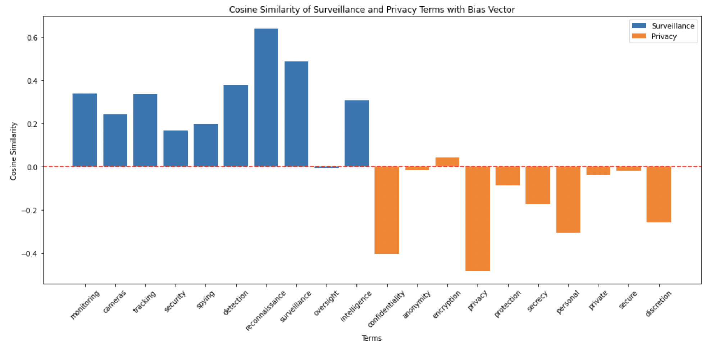

# Data Science Portfolio Overview

## Executive Summary

This portfolio demonstrates the strategic importance of data science in enhancing cybersecurity measures within a Fortune 100 organization. Through a series of completed and proposed projects aligned with the NIST Cybersecurity Framework, the report highlights how advanced analytical techniques can address the key responsibilities of a security team. The portfolio showcases practical applications of data science in areas such as threat detection, incident response, risk management, and compliance, illustrating how these approaches can improve the organization's security posture and resilience against cyber threats. It also invites collaboration on innovative future projects.

## Table of Contents
1. [Introduction](#1-introduction)
    - [1.1 Personal Overview](#11-personal-overview)
    - [1.2 Purpose of the Portfolio](#12-purpose-of-the-portfolio)
2. [Scope of Responsibility of the Security Team in a Fortune 100 Organization](#2-scope-of-responsibility-of-the-security-team-in-a-fortune-100-organization)
    - [2.1 Overview of the Security Team Role](#21-overview-of-the-security-team-role)
3. [Breakdown of Security Team Responsibilities According to the NIST Cybersecurity Framework](#3-breakdown-of-security-team-responsibilities-according-to-the-nist-cybersecurity-framework)
    - [3.1 NIST Cybersecurity Framework Overview](#31-nist-cybersecurity-framework-overview)
    - [3.2 Identify](#32-identify)
        - [3.2.1 Security Team Responsibilities](#321-security-team-responsibilities)
        - [3.2.2 Data Science Contribution](#322-data-science-contribution)
    - [3.3 Protect](#33-protect)
        - [3.3.1 Security Team Responsibilities](#331-security-team-responsibilities)
        - [3.3.2 Data Science Contribution](#332-data-science-contribution)
    - [3.4 Detect](#34-detect)
        - [3.4.1 Security Team Responsibilities](#341-security-team-responsibilities)
        - [3.4.2 Data Science Contribution](#342-data-science-contribution)
    - [3.5 Respond](#35-respond)
        - [3.5.1 Security Team Responsibilities](#351-security-team-responsibilities)
        - [3.5.2 Data Science Contribution](#352-data-science-contribution)
    - [3.6 Recover](#36-recover)
        - [3.6.1 Security Team Responsibilities](#361-security-team-responsibilities)
        - [3.6.2 Data Science Contribution](#362-data-science-contribution)
4. [Completed Deep Learning Projects](#4-completed-deep-learning-projects)
    - [4.1 Project: Neutralizing Surveillance Privacy Bias](#41-project-neutralizing-surveillance-privacy-bias)
    - [4.2 Project: Enhancing Phishing Detection with Neural Style Transfer](#42-project-enhancing-phishing-detection-with-neural-style-transfer)
    - [4.3 Project: U-Net in Cybersecurity: Precision Image Segmentation for Enhanced Security Measures](#43-project-u-net-in-cybersecurity-precision-image-segmentation-for-enhanced-security-measures)
    - [4.4 Project: Unlocking Cybersecurity Potential with Sentiment Analysis](#44-project-unlocking-cybersecurity-potential-with-sentiment-analysis)
5. [Strategic Insights from Kaggle Competitions](#5-strategic-insights-from-kaggle-competitions)
    - [5.1 Introduction](#51-introduction)
    - [5.2 Data Science Frameworks](#52-data-science-frameworks)
        - [5.2.1) Generalized Data Science Framework - Titanic](#521-generalized-datascience-framework-titanic)
## Executive Summary
    - [5.3 Data Preparation](#53-data-preparation)
    - [5.4 Model Specific](#54-model-specific)
6. [Proposed Projects](#6-proposed-projects)
    - [6.1 Project: Network Traffic Anomaly Detection](#61-project-network-traffic-anomaly-detection)
    - [6.2 Project: Threat Intelligence Aggregation](#62-project-threat-intelligence-aggregation)
    - [6.3 Project: Automated Incident Response](#63-project-automated-incident-response)
    - [6.4 Project: Forensic Analysis of Security Incidents](#64-project-forensic-analysis-of-security-incidents)
    - [6.5 Project: Risk Scoring for Cybersecurity](#65-project-risk-scoring-for-cybersecurity)
    - [6.6 Project: Compliance Monitoring System](#66-project-compliance-monitoring-system)
    - [6.7 Project: Predictive Vulnerability Analysis](#67-project-predictive-vulnerability-analysis)
    - [6.8 Project: Patch Management Optimization](#68-project-patch-management-optimization)
7. [Future Directions](#7-future-directions)
    - [7.1 Innovative Approaches](#71-innovative-approaches)
    - [7.2 Vision for the Future](#72-vision-for-the-future)
8. [Conclusion](#8-conclusion)
    - [8.1 Summary](#81-summary)
    - [8.2 Call to Action](#82-call-to-action)

## 1. Introduction

### 1.1 Personal Overview
My name is [Your Name], and I am a dedicated data scientist with a robust background in cybersecurity. Over the past few years, I have developed a keen interest in leveraging data science to address complex cybersecurity challenges. My expertise lies in applying advanced analytical techniques, such as machine learning, predictive analytics, and big data analytics, to enhance security measures.

### 1.2 Purpose of the Portfolio
The purpose of this portfolio is to demonstrate my ability to apply data science to tackle real-world cybersecurity problems effectively. It aims to show how data science can be strategically integrated into cybersecurity practices to enhance threat detection, incident response, risk management, and compliance, and to invite collaboration on innovative future projects.

## 2. Scope of Responsibility of the Security Team in a Fortune 100 Organization

### 2.1 Overview of the Security Team Role
The security team in a Fortune 100 organization is responsible for ensuring the security of the organization's information and technology assets. The security team's primary responsibilities include risk management, regulatory compliance, incident response, safeguarding assets, and strategic planning. In this role, the security team faces numerous challenges, including advanced persistent threats, zero-day vulnerabilities, insider threats, continuous monitoring, and resource allocation.

## 3. Breakdown of Security Team Responsibilities According to the NIST Cybersecurity Framework

### 3.1 NIST Cybersecurity Framework Overview
The NIST Cybersecurity Framework (NIST CSF) is a comprehensive guideline for managing and mitigating cybersecurity risks. It consists of five core functions: Identify, Protect, Detect, Respond, and Recover. Each function plays a crucial role in enhancing the organization's cybersecurity posture.

### 3.2 Identify

#### 3.2.1 Security Team Responsibilities
- **Asset Management**: Identifying and managing information assets to understand the organization’s environment.
- **Business Environment**: Understanding the organization’s mission, objectives, stakeholders, and activities.
- **Governance**: Establishing policies, procedures, and processes to manage and monitor the organization’s regulatory, legal, risk, environmental, and operational requirements.

#### 3.2.2 Data Science Contribution
- **Asset Identification**: Data mining techniques can be used to discover and classify assets from unstructured data. Clustering algorithms can group similar assets for better management, providing a comprehensive view of the organization's information assets.
- **Risk Assessment**: Predictive modeling can assess and quantify cybersecurity risks, while Monte Carlo simulations can model risk scenarios and outcomes. These approaches help prioritize risks and allocate resources effectively.
- **Governance Monitoring**: Anomaly detection algorithms can identify deviations from governance policies, ensuring compliance. Natural Language Processing (NLP) can analyze policy documents to monitor compliance with regulatory requirements.

### 3.3 Protect

#### 3.3.1 Security Team Responsibilities
- **Access Control**: Implementing measures to manage access to assets based on risk.
- **Awareness and Training**: Conducting security awareness education and training programs for staff.
- **Data Security**: Protecting information through encryption, data masking, and other measures.
- **Information Protection Processes and Procedures**: Maintaining and using security policies and procedures.
- **Maintenance and Protective Technology**: Ensuring the maintenance of security systems and the use of protective technology.

#### 3.3.2 Data Science Contribution
- **Access Control**: Behavioral biometrics can monitor and authenticate user behavior, enhancing access control mechanisms. Machine learning models can detect and prevent unauthorized access by identifying unusual patterns and behaviors.
- **Training Effectiveness**: Data analytics can analyze training outcomes and effectiveness, providing insights to improve security awareness programs. Adaptive learning systems can personalize training based on employee behavior, ensuring that training is relevant and effective.
- **Data Security**: Encryption analytics can ensure the effectiveness of encryption techniques, while data masking techniques can protect sensitive information in datasets. These approaches help safeguard data from unauthorized access and breaches.
- **Process Optimization**: Process mining can analyze and improve security processes, while statistical process control can monitor and control these processes. This ensures that security measures are efficient and effective.
- **Technology Maintenance**: Predictive maintenance algorithms can predict and prevent system failures, ensuring that security technologies are always operational. Time series analysis can forecast maintenance needs, optimizing the maintenance schedule.

### 3.4 Detect

#### 3.4.1 Security Team Responsibilities
- **Anomalies and Events**: Detecting anomalies and events and understanding their potential impact.
- **Continuous Monitoring**: Continuously monitoring networks and information systems for security incidents.
- **Detection Processes**: Developing and implementing detection processes and procedures.

#### 3.4.2 Data Science Contribution
- **Anomaly Detection**: Unsupervised learning can detect unknown threats without labeled data, identifying unusual patterns and behaviors. Real-time stream processing can analyze data in real time for immediate threat detection, ensuring rapid response to emerging threats.
- **Real-Time Monitoring**: Complex event processing (CEP) can monitor and correlate events from multiple sources, providing a comprehensive view of security events. Real-time dashboards can visualize and track security events live, enabling quick decision-making.
- **Incident Detection**: Supervised learning can train models on known threats to detect similar patterns, enhancing the accuracy of threat detection. Graph analytics can identify relationships and patterns in network data, revealing hidden threats and vulnerabilities.

### 3.5 Respond

#### 3.5.1 Security Team Responsibilities
- **Response Planning**: Developing and implementing response plans.
- **Communications**: Ensuring effective internal and external communication during and after incidents.
- **Analysis**: Conducting analysis to ensure effective response and support recovery activities.
- **Mitigation**: Implementing activities to prevent the expansion of an event and mitigate its effects.
- **Improvements**: Learning from past incidents to improve future response strategies.

#### 3.5.2 Data Science Contribution
- **Automated Response**: Reinforcement learning can develop adaptive response strategies, optimizing the response to different types of incidents. Robotic process automation (RPA) can automate repetitive response tasks, freeing up human resources for more complex activities.
- **Communication Optimization**: Social network analysis can optimize communication flows, ensuring that information reaches the right people at the right time. Sentiment analysis can monitor and manage stakeholder communications, providing insights into public and internal reactions to incidents.
- **Incident Analysis**: Root cause analysis can identify the root cause of incidents using data, enabling targeted mitigation measures. Forensic data analysis can reconstruct and analyze attack vectors, providing insights into how incidents occurred and how to prevent them in the future.
- **Mitigation Strategies**: Simulation models can test and optimize mitigation strategies, ensuring that they are effective. Scenario analysis can explore the impact of different response actions, helping to develop robust response plans.
- **Continuous Improvement**: Feedback loops can integrate data-driven insights into response plans, ensuring that they are continuously updated and improved. Performance metrics can measure and improve response effectiveness, providing a basis for benchmarking and improvement.

### 3.6 Recover

#### 3.6.1 Security Team Responsibilities
- **Recovery Planning**: Developing and implementing recovery plans to restore capabilities.
- **Improvements**: Implementing strategies to improve recovery capabilities based on lessons learned.
- **Communications**: Ensuring effective communication of recovery activities.

#### 3.6.2 Data Science Contribution
- **Recovery Optimization**: Optimization algorithms can minimize downtime and recovery time, ensuring rapid restoration of services. Capacity planning models can ensure that resources are available for recovery, optimizing resource allocation.
- **Learning from Incidents**: Post-incident reviews can analyze data from past incidents to improve recovery processes, ensuring that lessons are learned and applied. Machine learning insights can predict future incidents and prepare recovery plans, enhancing preparedness.
- **Communication Strategies**: Crisis communication models can ensure effective communication during recovery, providing clear and concise information to stakeholders. Information dissemination algorithms can manage and distribute recovery information, ensuring that it reaches the right people at the right time.

## 4. Completed Projects

### [4.1 Project: Neutralizing Surveillance Privacy Bias](https://github.com/rexcoleman/Neutralizing-Surveillance-Privacy-Bias)
- **Description**: This project addresses the critical issue of bias in cybersecurity, specifically focusing on surveillance privacy bias. The project aims to identify and mitigate biases that can compromise the effectiveness of security measures, lead to inefficient resource allocation, and damage user trust.
- **Tools and Techniques**: The project employs word embeddings to analyze and understand biases in surveillance and privacy-related terms. Techniques such as fairness-aware algorithms and continuous model evaluation are used to mitigate these biases.
- **Impact**: This project emphasizes the importance of addressing bias in cybersecurity to ensure fair and effective security measures. It highlights how biases can originate from historical data, algorithmic design, or human judgment and provides solutions to mitigate these biases.
- **Results**: The project successfully demonstrated how to neutralize surveillance privacy bias using word vectors, leading to more equitable and trustworthy security measures.

*Figure 1: Surveillance privacy bias vector - This image illustrates the surveillance privacy bias vector and how serveillance related terms in blue tend to be above the line and privacy related terms in orange tend to be below the line.*

*Figure 2: Name bias neutralization - The before image on the left illustrates the impact of bias in surveillance systems, highlighting how certain demographics may be disproportionately targeted or overlooked, leading to privacy concerns and unfair treatment.  The after image on the right demonstrates how techniques to neutralize bias associated with names in datasets, can level the playing field.*

### [4.2 Project: Enhancing Phishing Detection with Neural Style Transfer](https://github.com/rexcoleman/Enhancing_Phishing-Detection-With-Neural-Style-Transfer)
- **Description**: This project leverages Neural Style Transfer (NST) to enhance phishing detection by analyzing visual content. By merging the content of one image with the style of another, NST helps detect subtle visual discrepancies that indicate phishing attempts.
- **Tools and Techniques**: The project employs NST algorithms, pretrained ConvNets, and optimization techniques to analyze and generate images. The practical applications extend to phishing detection, image authentication, forensic analysis, and advanced obfuscation techniques.
- **Impact**: This project demonstrates the relevance of NST in cybersecurity, highlighting its potential to improve the detection, analysis, and prevention of cyber threats through advanced visual content analysis.
- **Results**: The project successfully applied NST to detect phishing websites and conceal sensitive information within images, showcasing its practical applications in enhancing cybersecurity measures.

*Figure 1: Detecting Phishing Websites with Neural Style Transfer - This image shows an exagerated visual representation of a legitimate website credit card form being altered by a hactivist meme and the resulting suspicious phishing website. The cybersecurity goal in this context is to identify phishing websites pretending to be legitimate websites but with subtly different style.*

*Figure 2: Surf Art Stenography - This image shows an exagerated visual representaqtion of a cybercriminal concealing sensitive infromation (Basquiat Painting) inside a surf image. The cybersecurity goal in this context would be to identify sensitive information such as malware or encryption keys that a threat actor subtly hid within the image to avoid detection.*

### [4.3 Project: U-Net in Cybersecurity: Precision Image Segmentation for Enhanced Security Measures](https://github.com/rexcoleman/U-Net-in-Cybersecurity-Precision-Image-Segmentation-for-Enhanced-Security-Measures)
- **Description**: This project showcases the application of U-Net, a powerful convolutional neural network architecture, in cybersecurity through precision image segmentation. U-Net's ability to accurately segment images has significant implications for enhancing security measures such as intrusion detection, anomaly detection in network traffic, facial recognition for access control, and digital forensics.
- **Tools and Techniques**: The project employs U-Net architecture for precise image segmentation tasks, demonstrating its capabilities using the CARLA self-driving car dataset.
- **Impact**: This project highlights U-Net's potential to improve security measures by accurately segmenting and analyzing images, thus enhancing various cybersecurity applications.
- **Results**: The project successfully demonstrated U-Net's effectiveness in semantic image segmentation, illustrating its application to cybersecurity contexts.

Releated Malware Families                             | Unreleated Malware Families
:---------------------------------------------------: | :---------------------------------------------------:
 | 

*Figure 2: U-net's ability to segment features in images could be applied to a wide array of cybersecurity use cases. As an exsample, this figure shows images of related malware families (left) and unrelated malware families (right).*

### [4.4 Project: Unlocking Cybersecurity Potential with Sentiment Analysis](https://github.com/rexcoleman/Unlocking-Cybersecurity-Potential-with-Sentiment-Analysis)
- **Description**: This project explores the diverse applications of sentiment analysis in cybersecurity, focusing on practical implementations such as the Emojify project. By analyzing sentiments expressed in textual data from various sources, organizations can proactively manage risks, improve incident handling, and safeguard their reputation.
- **Tools and Techniques**: The project employs natural language processing (NLP) techniques, including word embeddings and sequence models like LSTM, to analyze and classify sentiments.
- **Impact**: This project highlights the significance of sentiment analysis in enhancing threat detection, incident response, and overall security strategies. It demonstrates how understanding sentiments can lead to more proactive and effective cybersecurity measures.
- **Results**: The Emojify project successfully created an embedding matrix and demonstrated the advantages of the GloVe algorithm. A sentiment classifier was built using word embeddings, and a more sophisticated classifier using an LSTM was trained, improving the accuracy of sentiment classification tasks.

*Figure 1: This image showing how the GloVe algorithm was used to classify sentiment analysis by appling an Emoji at the end of a sentence.*

## 5. Strategic Insights from Kaggle Competitions

### [5.1 Introduction](https://github.com/rexcoleman/Kaggle-Competition-Value-Proposition-For-Advancing-Data-Science/tree/main)

In today's rapidly evolving landscape of data science and artificial intelligence (AI), the strategic significance of Kaggle competitions cannot be overstated. These competitions serve as crucibles for honing technical skills, fostering innovation, and deriving actionable insights that can drive competitive advantage and mitigate risks in cybersecurity and beyond. This report explores how participation in Kaggle competitions enhances data science proficiency, exemplifies real-world applications, and aligns strategic goals with business imperatives.

### [5.2 Data Science Frameworks](https://github.com/rexcoleman/Importance-of-Structured-Approaches-in-Data-Science/tree/main)
In today's rapidly evolving landscape of data science and artificial intelligence (AI), the strategic significance of structured approaches cannot be overstated. These methodologies serve as frameworks for honing technical skills, fostering innovation, and deriving actionable insights that can drive competitive advantage and mitigate risks in various fields, including cybersecurity. This report explores how structured approaches like CRISP-DM, TDSP, Agile Data Science, and Lean Data Science enhance data science proficiency, exemplify real-world applications, and align strategic goals with business imperatives.

#### [5.2.1) Generalized Data Science Framework - Titanic](https://github.com/rexcoleman/GeneralizedDataScienceFramework-Titanic)
## Executive Summary

This project provides a comprehensive framework for solving data science problems. The project builds upon one of the most popular [Kaggle notebooks](https://www.kaggle.com/code/ldfreeman3/a-data-science-framework-to-achieve-99-accuracy), leveraging best-in-class methodologies to create a reliable foundation for solving data science problems. By reproducing and substantially building upon this work, I aim to illustrate the value of learning from top practitioners while also solving one of the most important problems in data science.

Rushing into a data science project without a structured approach can lead to numerous problems, which can severely impact project success, cost, and outcomes. This project addresses these issues by implementing a well-defined framework and best practices ensuring thorough problem understanding, effective data preprocessing, and robust model evaluation.

Borrowing fron the giants of Agile, DevOps, and Lean Entrepreneurship, we are leveragine the concept of ['shifting left'](https://en.wikipedia.org/wiki/Shift-left_testing) to support a more flexible and adaptive development process, facilitating faster delivery of high-quality data science solutions that originate from clearly defined business needs.

This project applies the above concepts to the popular "Titanic - Machine Learning from Disaster" Kaggle competition and can applied generally to a wide array of data science problems.

Thank you for visiting my repository. I hope this project inspires you to implement a structured approach to avoid common data science pitfalls.  I welcome comments: especially those that will help improve upon this concept.

*Figure 1: Model Accuracy - This plot shows train, validate and test model accuracies in Kaggle test accuracy order.  The top four models (BaggineClassifier, BernoulliNB, XGBClassifier and EnsembleHardVoting) outperformed both hard and soft voting ensemble models.  The Baseline Handmade Decision Tree model several other models.*

*Figure 3: Model Error Plot - This plot compares model error across multiple models. Bias error is defined as perfect accuracy minus train accuracy. Variance is defined as test error and train error.  Typically it is better to use the difference in dev errer (validation error) and training error.  In the case of our models, there is a wide margin between test error and validation error so I am including it in my variance error calculation.*

### 5.3 Data Preparation
Data preparation is a critical step in the data science workflow, and Kaggle competitions emphasize its importance. Techniques such as data cleaning, normalization, and feature engineering are pivotal in transforming raw data into a format suitable for modeling. Effective data preparation leads to better model performance and more accurate predictions.

### 5.4 Model Specific
Kaggle competitions provide a platform to experiment with various model-specific techniques and architectures. This includes fine-tuning hyperparameters, implementing ensemble methods, and applying transfer learning. Through iterative experimentation, data scientists can optimize their models to achieve the best possible performance.

## 6. Proposed Projects

### 6.1 Project: Network Traffic Anomaly Detection
- **Description**: This proposed project involves developing a machine learning model to detect anomalies in network traffic. By analyzing network traffic data, the model will identify unusual patterns that may indicate a security threat.
- **Tools and Techniques**: The project will use unsupervised learning algorithms, clustering techniques, and real-time stream processing.
- **Impact**: This project aims to address the challenge of detecting advanced persistent threats and zero-day vulnerabilities by identifying anomalous behavior in network traffic.
- **Invitation to Collaborate**: I invite interested parties to collaborate on this project. Your expertise and contributions will be invaluable in making this project a success.

### 6.2 Project: Threat Intelligence Aggregation
- **Description**: This proposed project focuses on aggregating and analyzing threat intelligence data from various sources. By using natural language processing and machine learning, the project aims to identify emerging threats and provide actionable insights.
- **Tools and Techniques**: The project will use natural language processing (NLP), machine learning algorithms, and data aggregation techniques.
- **Impact**: The project aims to enhance the organization’s threat intelligence capabilities, allowing for proactive identification of emerging threats.
- **Invitation to Collaborate**: I invite interested parties to collaborate on this project. Your expertise and contributions will be invaluable in making this project a success.

### 6.3 Project: Automated Incident Response
- **Description**: This proposed project involves developing an automated incident response system that uses reinforcement learning to dynamically adjust its response strategies based on the evolving threat landscape.
- **Tools and Techniques**: The project will use reinforcement learning, automated response systems, and real-time analysis.
- **Impact**: The project aims to address the challenge of reducing response times to security incidents by automating the response process.
- **Invitation to Collaborate**: I invite interested parties to collaborate on this project. Your expertise and contributions will be invaluable in making this project a success.

### 6.4 Project: Forensic Analysis of Security Incidents
- **Description**: This proposed project focuses on using data science techniques to analyze log data and reconstruct attack timelines. The goal is to understand how security incidents occurred and prevent future attacks.
- **Tools and Techniques**: The project will use clustering, pattern recognition, and log analysis techniques.
- **Impact**: The project aims to enhance the organization’s forensic analysis capabilities, allowing for a better understanding of security incidents.
- **Invitation to Collaborate**: I invite interested parties to collaborate on this project. Your expertise and contributions will be invaluable in making this project a success.

### 6.5 Project: Risk Scoring for Cybersecurity
- **Description**: This proposed project involves developing a risk scoring model that quantifies the cybersecurity risk associated with different assets and activities. The model will help prioritize security efforts based on risk.
- **Tools and Techniques**: The project will use logistic regression, decision trees, and risk assessment techniques.
- **Impact**: The project aims to address the challenge of risk management by providing a data-driven approach to quantifying and prioritizing risk.
- **Invitation to Collaborate**: I invite interested parties to collaborate on this project. Your expertise and contributions will be invaluable in making this project a success.

### 6.6 Project: Compliance Monitoring System
- **Description**: This proposed project focuses on developing a compliance monitoring system that uses rule-based algorithms and machine learning to continuously monitor regulatory compliance.
- **Tools and Techniques**: The project will use rule-based algorithms, machine learning, and real-time monitoring techniques.
- **Impact**: The project aims to enhance the organization’s ability to ensure compliance with relevant regulations and industry standards.
- **Invitation to Collaborate**: I invite interested parties to collaborate on this project. Your expertise and contributions will be invaluable in making this project a success.

### 6.7 Project: Predictive Vulnerability Analysis
- **Description**: This proposed project involves using machine learning to predict which vulnerabilities are most likely to be exploited. The goal is to prioritize vulnerabilities based on their likelihood of exploitation.
- **Tools and Techniques**: The project will use supervised learning techniques, historical data analysis, and vulnerability assessment.
- **Impact**: The project aims to address the challenge of vulnerability management by providing a data-driven approach to prioritizing vulnerabilities.
- **Invitation to Collaborate**: I invite interested parties to collaborate on this project. Your expertise and contributions will be invaluable in making this project a success.

### 6.8 Project: Patch Management Optimization
- **Description**: This proposed project focuses on optimizing the patch management process using data-driven strategies. The goal is to ensure that patches are applied efficiently and effectively.
- **Tools and Techniques**: The project will use optimization algorithms, scheduling techniques, and patch management.
- **Impact**: The project aims to enhance the organization’s ability to manage patches, reducing downtime and minimizing the risk of exploitation.
- **Invitation to Collaborate**: I invite interested parties to collaborate on this project. Your expertise and contributions will be invaluable in making this project a success.

## 7. Future Directions

### 7.1 Innovative Approaches
- **Advanced AI Techniques**: Discuss the potential of advanced AI techniques, such as deep learning and neural networks, in cybersecurity. These techniques can enhance threat detection and response capabilities, providing more accurate and efficient security measures.
- **Behavioral Analytics**: Explain the role of behavioral analytics in detecting insider threats and enhancing security. By monitoring and analyzing user behavior, organizations can identify unusual patterns that may indicate malicious activity.
- **Integration with IoT Security**: Discuss the unique security challenges posed by the Internet of Things (IoT) and potential data science solutions. IoT devices can introduce new vulnerabilities, and data science techniques can help identify and mitigate these risks.

### 7.2 Vision for the Future
- **Integrated Security Approach**: Describe your vision for a more integrated and proactive approach to cybersecurity. This involves combining data science techniques with traditional security measures to create a comprehensive security strategy.
- **Advancing Analytical Capabilities**: Discuss the importance of continuously advancing analytical capabilities to stay ahead of cyber threats. This includes adopting new technologies and methodologies to enhance threat detection and response.
- **Embracing Emerging Technologies**: Highlight the need to embrace emerging technologies to enhance security measures. By staying up-to-date with technological advancements, organizations can improve their security posture and better protect against evolving threats.

## 8. Conclusion

### 8.1 Summary
In this portfolio, I have demonstrated how data science can enhance the security team's ability to manage and mitigate cybersecurity risks. By leveraging advanced analytical techniques, organizations can improve their threat detection, response, and recovery capabilities. Data science provides a strategic advantage, enabling proactive and efficient security measures.

### 8.2 Call to Action
I am enthusiastic about the opportunity to further discuss and explore the integration of data science in cybersecurity with industry leaders. I look forward to collaborating on innovative solutions and contributing to the field of cybersecurity.

---

By following this structured approach, you will present a detailed and compelling portfolio that effectively demonstrates your skills and expertise in data science and cybersecurity. Each section highlights the impact of your work and aligns your projects with the responsibilities of a security team, making you an attractive candidate for positions within the industry.
