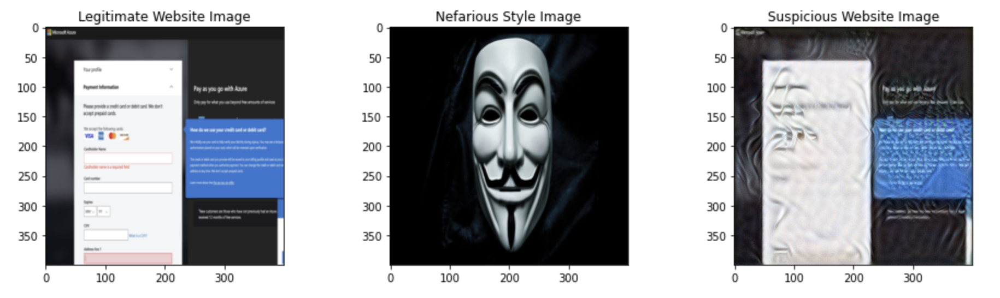
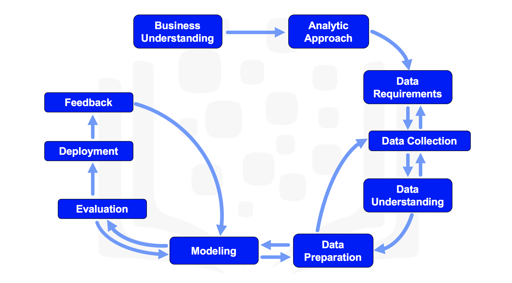
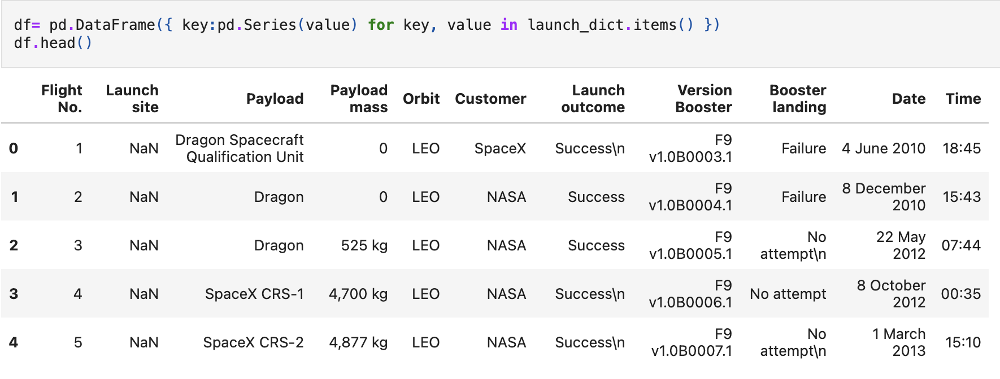

# RexColeman_Cybersecurity_MachineLearning_Portfolio

## Executive Summary

This portfolio demonstrates my capability to leverage data science and machine learning to solve complex cybersecurity challenges. As a futurist and strategic thinker, I anticipate technological trends and develop proactive solutions to address emerging cybersecurity needs. This portfolio highlights my journey through various projects and methodologies, illustrating my readiness to enhance the security posture of large organizations by staying ahead of technological trends.

Through a series of completed and proposed projects aligned with the NIST Cybersecurity Framework, this portfolio showcases practical applications of data science in threat detection, incident response, risk management, and compliance. It also invites collaboration on innovative future projects, aiming to drive strategic initiatives and enhance organizational resilience against cyber threats.

## Table of Contents
1. [Introduction](#1-introduction)
    - [1.1 Personal Overview](#11-personal-overview)
    - [1.2 Purpose of the Portfolio](#12-purpose-of-the-portfolio)
2. [Scope of Responsibility of the Security Team in a Fortune 100 Organization](#2-scope-of-responsibility-of-the-security-team-in-a-fortune-100-organization)
    - [2.1 Overview of the Security Team Role](#21-overview-of-the-security-team-role)
3. [NIST Cybrersecurity Framework: How Data Science Contributes to Cybresecurity Teams](#3-nist-cybrersecurity-framework-how-data-science-contributes-to-cybresecurity-teams)
4. [Deep Learning](#4-deep-learning)
    - [4.1 Introduction](#41-introduction)
        - [4.1.1 Report: Comparing and Contrasting Deep Learning Models for Cybersecurity Application](#411-report-comparing-and-contrasting-deep-learning-models-for-cybersecurity-application)
        - [4.1.2 Proposed Report: A Data Journey Through The MITRE ATTACK Framework]
    - [4.2 Completed Deep Learning Projects](#42-completed-deep-learning-projects)
        - [4.2.1 Project: Neutralizing Surveillance Privacy Bias](#421-project-neutralizing-surveillance-privacy-bias)
        - [4.2.2 Project: Enhancing Phishing Detection with Neural Style Transfer](#422-project-enhancing-phishing-detection-with-neural-style-transfer)
        - [4.2.3 Project: U-Net in Cybersecurity: Precision Image Segmentation for Enhanced Security Measures](#423-project-u-net-in-cybersecurity-precision-image-segmentation-for-enhanced-security-measures)
        - [4.2.4 Project: Unlocking Cybersecurity Potential with Sentiment Analysis](#424-project-unlocking-cybersecurity-potential-with-sentiment-analysis)
5. [Data Science Process](#5-data-science-process)
    - [5.1 Data Science Methodologies](#51-data-science-methodologies)
        - [5.1.1 Report: Data-Driven Defense - Adapting Data Science Methodologies for Cybersecurity Excellence](#511-report-data-driven-defense---adapting-data-science-methodologies-for-cybersecurity-excellence)
        - [5.1.2 Report: Strategic Importance of Kaggle Competitions in Advancing Data Science](#512-report-strategic-importance-of-kaggle-competitions-in-advancing-data-science)
        - [5.1.3 Report: How to Win Kaggle Competitions](#513-report-how-to-win-kaggle-competitions)
        - [5.1.4 Project: Hybrid Data Science Methodology - Titanic](#514-project-hybrid-data-science-methodology---titanic)
        - [5.1.5 Project: CRISP-DM Methodology Case Study: Predicting Diabetes Onset Using the Pima Indians Diabetes Database](#515-project-crisp-dm-methodology-case-study-predicting-diabetes-onset-using-the-pima-indians-diabetes-database)
        - [5.1.6 Project: IBM Data Science Methodology](#516-project-ibm-data-science-methodology)
    - [5.2 Data Preparation](#52-data-preparation)
        - [5.2.1 Report: Unlocking Data Potential - Advanced Feature Engineering Techniques for Cybersecurity](#521-report-unlocking-data-potential---advanced-feature-engineering-techniques-for-cybersecurity)
        - [5.2.2 Project: Feature Engineering Deep Dive - Pima Indians](#522-project-feature-engineering-deep-dive---pima-indians)
        - [5.2.3 Project: Outlier Detection and Treatment - Pima Indians](#523-project-outlier-detection-and-treatment---pima-indians)
    - [5.3 Modeling](#53-modeling)
        - [5.3.1 Report: Data Science Model Selection in Cybersecurity](#531-report-data-science-model-selection-in-cybersecurity)
        - [5.3.2 Project: TensorFlow - Decision Forest - Titanic](#532-project-tensorflow---decision-forest---titanic)
6. [Computer Science Fundamentals](#6-computer-science-fundamentals)
    - [6.1 Software Development](#61-software-development)
        - [6.1.1 100 Days of Code: The Complete Python Pro Bootcamp](#611-100-days-of-code-the-complete-python-pro-bootcamp)
        - [6.1.2 Data Structures and Algorithms](#612-data-structures-and-algorithms)
    - [6.2 Mathematics for Computer Science and Machine Learning](#62-mathematics-for-computer-science-and-machine-learning)
8. [Proposed Projects](#7-proposed-projects)
    - [7.1 Project: Network Traffic Anomaly Detection](#71-project-network-traffic-anomaly-detection)
    - [7.2 Project: Threat Intelligence Aggregation](#72-project-threat-intelligence-aggregation)
    - [7.3 Project: Automated Incident Response](#73-project-automated-incident-response)
    - [7.4 Project: Forensic Analysis of Security Incidents](#74-project-forensic-analysis-of-security-incidents)
    - [7.5 Project: Risk Scoring for Cybersecurity](#75-project-risk-scoring-for-cybersecurity)
    - [7.6 Project: Compliance Monitoring System](#76-project-compliance-monitoring-system)
    - [7.7 Project: Predictive Vulnerability Analysis](#77-project-predictive-vulnerability-analysis)
    - [7.8 Project: Patch Management Optimization](#78-project-patch-management-optimization)
9. [Future Directions](#8-future-directions)
    - [8.1 Innovative Approaches](#81-innovative-approaches)
    - [8.2 Vision for the Future](#82-vision-for-the-future)
10. [Conclusion](#9-conclusion)
    - [9.1 Summary](#91-summary)
    - [9.2 Call to Action](#92-call-to-action)

## 1. Introduction

### 1.1 Personal Overview
My name is Rex Coleman, and I am a dedicated data scientist with a robust background in cybersecurity. Over the past few years, I have developed a keen interest in leveraging data science to address complex cybersecurity challenges. My expertise lies in applying advanced analytical techniques, such as machine learning, predictive analytics, and big data analytics, to enhance security measures.

My name is Rex Coleman.  I am a data scientist with a strong background in cybersecurity, dedicated to driving innovation and achieving market leadership. My career journey has been shaped by a passion for solving complex problems and a commitment to continuous learning. I am attending Georgia Tech's Master's of Science in Analytics program, top-5 nationally ranked for data science and analytics, hold a Masters in Business Administration from the Melbourne Business School in Australia, and a Bachelor of Science in Biochemistry and Molecular Biology from the University of California Santa Cruz.  I worked at FireEye / Mandiant for decade starting when FireEye was an 80 person company.  For half that time I held a variety of data related roles and for the other half, I learned the art of business as a sales rep.  Most recently, I took a few bets as an entrepreneur exploring how to solve cybersecurity problems with blockchain technology. 

### 1.2 Purpose of the Portfolio
The purpose of this portfolio is to demonstrate my ability to apply data science to tackle real-world cybersecurity problems effectively. It aims to show how data science can be strategically integrated into cybersecurity practices to enhance threat detection, incident response, risk management, and compliance, and to invite collaboration on innovative future projects.

## 2. Scope of Responsibility of the Security Team in a Fortune 100 Organization

### 2.1 Overview of the Security Team Role
The security team in a Fortune 100 organization is responsible for ensuring the security of the organization's information and technology assets. The security team's primary responsibilities include risk management, regulatory compliance, incident response, safeguarding assets, and strategic planning. In this role, the security team faces numerous challenges, including advanced persistent threats, zero-day vulnerabilities, insider threats, continuous monitoring, and resource allocation.

## 3. NIST Cybrersecurity Framework: How Data Science Contributes to Cybresecurity Teams

### 3.1 NIST Cybersecurity Framework Overview
The NIST Cybersecurity Framework (NIST CSF) is a comprehensive guideline for managing and mitigating cybersecurity risks. It consists of five core functions: Identify, Protect, Detect, Respond, and Recover. Each function plays a crucial role in enhancing the organization's cybersecurity posture.

### 3.2 Identify

#### 3.2.1 Security Team Responsibilities
- **Asset Management**: Identifying and managing information assets to understand the organization’s environment.
- **Business Environment**: Understanding the organization’s mission, objectives, stakeholders, and activities.
- **Governance**: Establishing policies, procedures, and processes to manage and monitor the organization’s regulatory, legal, risk, environmental, and operational requirements.

#### 3.2.2 Data Science Contribution
- **Asset Identification**: Data mining techniques can be used to discover and classify assets from unstructured data. Clustering algorithms can group similar assets for better management, providing a comprehensive view of the organization's information assets.
- **Risk Assessment**: Predictive modeling can assess and quantify cybersecurity risks, while Monte Carlo simulations can model risk scenarios and outcomes. These approaches help prioritize risks and allocate resources effectively.
- **Governance Monitoring**: Anomaly detection algorithms can identify deviations from governance policies, ensuring compliance. Natural Language Processing (NLP) can analyze policy documents to monitor compliance with regulatory requirements.

### 3.3 Protect

#### 3.3.1 Security Team Responsibilities
- **Access Control**: Implementing measures to manage access to assets based on risk.
- **Awareness and Training**: Conducting security awareness education and training programs for staff.
- **Data Security**: Protecting information through encryption, data masking, and other measures.
- **Information Protection Processes and Procedures**: Maintaining and using security policies and procedures.
- **Maintenance and Protective Technology**: Ensuring the maintenance of security systems and the use of protective technology.

#### 3.3.2 Data Science Contribution
- **Access Control**: Behavioral biometrics can monitor and authenticate user behavior, enhancing access control mechanisms. Machine learning models can detect and prevent unauthorized access by identifying unusual patterns and behaviors.
- **Training Effectiveness**: Data analytics can analyze training outcomes and effectiveness, providing insights to improve security awareness programs. Adaptive learning systems can personalize training based on employee behavior, ensuring that training is relevant and effective.
- **Data Security**: Encryption analytics can ensure the effectiveness of encryption techniques, while data masking techniques can protect sensitive information in datasets. These approaches help safeguard data from unauthorized access and breaches.
- **Process Optimization**: Process mining can analyze and improve security processes, while statistical process control can monitor and control these processes. This ensures that security measures are efficient and effective.
- **Technology Maintenance**: Predictive maintenance algorithms can predict and prevent system failures, ensuring that security technologies are always operational. Time series analysis can forecast maintenance needs, optimizing the maintenance schedule.

### 3.4 Detect

#### 3.4.1 Security Team Responsibilities
- **Anomalies and Events**: Detecting anomalies and events and understanding their potential impact.
- **Continuous Monitoring**: Continuously monitoring networks and information systems for security incidents.
- **Detection Processes**: Developing and implementing detection processes and procedures.

#### 3.4.2 Data Science Contribution
- **Anomaly Detection**: Unsupervised learning can detect unknown threats without labeled data, identifying unusual patterns and behaviors. Real-time stream processing can analyze data in real time for immediate threat detection, ensuring rapid response to emerging threats.
- **Real-Time Monitoring**: Complex event processing (CEP) can monitor and correlate events from multiple sources, providing a comprehensive view of security events. Real-time dashboards can visualize and track security events live, enabling quick decision-making.
- **Incident Detection**: Supervised learning can train models on known threats to detect similar patterns, enhancing the accuracy of threat detection. Graph analytics can identify relationships and patterns in network data, revealing hidden threats and vulnerabilities.

### 3.5 Respond

#### 3.5.1 Security Team Responsibilities
- **Response Planning**: Developing and implementing response plans.
- **Communications**: Ensuring effective internal and external communication during and after incidents.
- **Analysis**: Conducting analysis to ensure effective response and support recovery activities.
- **Mitigation**: Implementing activities to prevent the expansion of an event and mitigate its effects.
- **Improvements**: Learning from past incidents to improve future response strategies.

#### 3.5.2 Data Science Contribution
- **Automated Response**: Reinforcement learning can develop adaptive response strategies, optimizing the response to different types of incidents. Robotic process automation (RPA) can automate repetitive response tasks, freeing up human resources for more complex activities.
- **Communication Optimization**: Social network analysis can optimize communication flows, ensuring that information reaches the right people at the right time. Sentiment analysis can monitor and manage stakeholder communications, providing insights into public and internal reactions to incidents.
- **Incident Analysis**: Root cause analysis can identify the root cause of incidents using data, enabling targeted mitigation measures. Forensic data analysis can reconstruct and analyze attack vectors, providing insights into how incidents occurred and how to prevent them in the future.
- **Mitigation Strategies**: Simulation models can test and optimize mitigation strategies, ensuring that they are effective. Scenario analysis can explore the impact of different response actions, helping to develop robust response plans.
- **Continuous Improvement**: Feedback loops can integrate data-driven insights into response plans, ensuring that they are continuously updated and improved. Performance metrics can measure and improve response effectiveness, providing a basis for benchmarking and improvement.

### 3.6 Recover

#### 3.6.1 Security Team Responsibilities
- **Recovery Planning**: Developing and implementing recovery plans to restore capabilities.
- **Improvements**: Implementing strategies to improve recovery capabilities based on lessons learned.
- **Communications**: Ensuring effective communication of recovery activities.

#### 3.6.2 Data Science Contribution
- **Recovery Optimization**: Optimization algorithms can minimize downtime and recovery time, ensuring rapid restoration of services. Capacity planning models can ensure that resources are available for recovery, optimizing resource allocation.
- **Learning from Incidents**: Post-incident reviews can analyze data from past incidents to improve recovery processes, ensuring that lessons are learned and applied. Machine learning insights can predict future incidents and prepare recovery plans, enhancing preparedness.
- **Communication Strategies**: Crisis communication models can ensure effective communication during recovery, providing clear and concise information to stakeholders. Information dissemination algorithms can manage and distribute recovery information, ensuring that it reaches the right people at the right time.

## 4. Deep Learning

### 4.1 Introduction

#### [4.1.1 Report: Comparing and Contrasting Deep Learning Models for Cybersecurity Application](https://github.com/rexcoleman/Comparing-and-Contrasting-Deep-Learning-Models-for-Cybersecurity-Application/tree/main)

In the rapidly evolving field of cybersecurity, the application of deep learning models offers significant promise for enhancing threat detection, anomaly identification, and overall security measures. This report explores various deep learning models and their applicability to solving complex cybersecurity problems. By comparing and contrasting different models, the report aims to provide cybersecurity professionals with a clear understanding of when and how to utilize these advanced techniques to protect against increasingly sophisticated cyber threats.

We begin by categorizing the models into supervised learning, unsupervised learning, reinforcement learning, and hybrid and specialized models. Each category is then broken down into specific models, such as Convolutional Neural Networks (CNNs), Generative Adversarial Networks (GANs), and Deep Q-Networks (DQNs), detailing their strengths, weaknesses, and ideal use cases. Additionally, the report discusses advanced learning paradigms like transfer learning and federated learning, which further enhance the adaptability and efficacy of deep learning in cybersecurity.

The report emphasizes that the key to successful implementation of these models lies in understanding the specific security challenges at hand and selecting the appropriate model to address them. By leveraging the insights provided, organizations can better align their data science strategies with their security objectives, ultimately achieving a more robust and resilient cybersecurity posture. [Read More...](https://github.com/rexcoleman/Comparing-and-Contrasting-Deep-Learning-Models-for-Cybersecurity-Application/tree/main)

### 4.2 Completed Deep Learning Projects

#### [4.2.1 Project: Neutralizing Surveillance Privacy Bias](https://github.com/rexcoleman/Neutralizing-Surveillance-Privacy-Bias)
- **Description**: This project addresses the critical issue of bias in cybersecurity, specifically focusing on surveillance privacy bias. The project aims to identify and mitigate biases that can compromise the effectiveness of security measures, lead to inefficient resource allocation, and damage user trust.
- **Tools and Techniques**: The project employs word embeddings to analyze and understand biases in surveillance and privacy-related terms. Techniques such as fairness-aware algorithms and continuous model evaluation are used to mitigate these biases.
- **Impact**: This project emphasizes the importance of addressing bias in cybersecurity to ensure fair and effective security measures. It highlights how biases can originate from historical data, algorithmic design, or human judgment and provides solutions to mitigate these biases.
- **Results**: The project successfully demonstrated how to neutralize surveillance privacy bias using word vectors, leading to more equitable and trustworthy security measures. 

*Figure 1: Surveillance privacy bias vector - This image illustrates the surveillance privacy bias vector and how serveillance related terms in blue tend to be above the line and privacy related terms in orange tend to be below the line.*

*Figure 2: Name bias neutralization - The before image on the left illustrates the impact of bias in surveillance systems, highlighting how certain demographics may be disproportionately targeted or overlooked, leading to privacy concerns and unfair treatment.  The after image on the right demonstrates how techniques to neutralize bias associated with names in datasets, can level the playing field.*

[Read More...](https://github.com/rexcoleman/Neutralizing-Surveillance-Privacy-Bias)

#### [4.2.2 Project: Enhancing Phishing Detection with Neural Style Transfer](https://github.com/rexcoleman/Enhancing_Phishing-Detection-With-Neural-Style-Transfer)
- **Description**: This project leverages Neural Style Transfer (NST) to enhance phishing detection by analyzing visual content. By merging the content of one image with the style of another, NST helps detect subtle visual discrepancies that indicate phishing attempts.
- **Tools and Techniques**: The project employs NST algorithms, pretrained ConvNets, and optimization techniques to analyze and generate images. The practical applications extend to phishing detection, image authentication, forensic analysis, and advanced obfuscation techniques.
- **Impact**: This project demonstrates the relevance of NST in cybersecurity, highlighting its potential to improve the detection, analysis, and prevention of cyber threats through advanced visual content analysis.
- **Results**: The project successfully applied NST to detect phishing websites and conceal sensitive information within images, showcasing its practical applications in enhancing cybersecurity measures. 

*Figure 1: Detecting Phishing Websites with Neural Style Transfer - This image shows an exagerated visual representation of a legitimate website credit card form being altered by a hactivist meme and the resulting suspicious phishing website. The cybersecurity goal in this context is to identify phishing websites pretending to be legitimate websites but with subtly different style.*

*Figure 2: Surf Art Stenography - This image shows an exagerated visual representaqtion of a cybercriminal concealing sensitive infromation (Basquiat Painting) inside a surf image. The cybersecurity goal in this context would be to identify sensitive information such as malware or encryption keys that a threat actor subtly hid within the image to avoid detection.*

[Read More...](https://github.com/rexcoleman/Enhancing_Phishing-Detection-With-Neural-Style-Transfer)

#### [4.2.3 Project: U-Net in Cybersecurity: Precision Image Segmentation for Enhanced Security Measures](https://github.com/rexcoleman/U-Net-in-Cybersecurity-Precision-Image-Segmentation-for-Enhanced-Security-Measures)
- **Description**: This project showcases the application of U-Net, a powerful convolutional neural network architecture, in cybersecurity through precision image segmentation. U-Net's ability to accurately segment images has significant implications for enhancing security measures such as intrusion detection, anomaly detection in network traffic, facial recognition for access control, and digital forensics.
- **Tools and Techniques**: The project employs U-Net architecture for precise image segmentation tasks, demonstrating its capabilities using the CARLA self-driving car dataset.
- **Impact**: This project highlights U-Net's potential to improve security measures by accurately segmenting and analyzing images, thus enhancing various cybersecurity applications.
- **Results**: The project successfully demonstrated U-Net's effectiveness in semantic image segmentation, illustrating its application to cybersecurity contexts. 

Releated Malware Families                             | Unreleated Malware Families
:---------------------------------------------------: | :---------------------------------------------------:
 | 

*Figure 2: U-net's ability to segment features in images could be applied to a wide array of cybersecurity use cases. As an exsample, this figure shows images of related malware families (left) and unrelated malware families (right).*

[Read More...](https://github.com/rexcoleman/U-Net-in-Cybersecurity-Precision-Image-Segmentation-for-Enhanced-Security-Measures)

#### [4.2.4 Project: Unlocking Cybersecurity Potential with Sentiment Analysis](https://github.com/rexcoleman/Unlocking-Cybersecurity-Potential-with-Sentiment-Analysis)
- **Description**: This project explores the diverse applications of sentiment analysis in cybersecurity, focusing on practical implementations such as the Emojify project. By analyzing sentiments expressed in textual data from various sources, organizations can proactively manage risks, improve incident handling, and safeguard their reputation.
- **Tools and Techniques**: The project employs natural language processing (NLP) techniques, including word embeddings and sequence models like LSTM, to analyze and classify sentiments.
- **Impact**: This project highlights the significance of sentiment analysis in enhancing threat detection, incident response, and overall security strategies. It demonstrates how understanding sentiments can lead to more proactive and effective cybersecurity measures.
- **Results**: The Emojify project successfully created an embedding matrix and demonstrated the advantages of the GloVe algorithm. A sentiment classifier was built using word embeddings, and a more sophisticated classifier using an LSTM was trained, improving the accuracy of sentiment classification tasks. 

*Figure 1: This image showing how the GloVe algorithm was used to classify sentiment analysis by appling an Emoji at the end of a sentence.*

[Read More...](https://github.com/rexcoleman/Unlocking-Cybersecurity-Potential-with-Sentiment-Analysis)

## 5. Data Science Process

### 5.1 Data Science Methodologies

### [5.1.1 Report: Data-Driven Defense - Adapting Data Science Methodologies for Cybersecurity Excellence](https://github.com/rexcoleman/Data-Driven-Defense-Adapting-Data-Science-Methodologies-for-Cybersecurity-Excellence)
#### Executive Summary

In today's rapidly evolving cyber threat landscape, integrating data science methodologies into cybersecurity practices has become essential. This report explores both general and specialized data science methodologies, including CRISP-DM, IBM Data Science Methodology, and cybersecurity-specific frameworks such as CSDS. By examining how these methodologies can be adapted to meet the complex challenges of cybersecurity, this report provides a comprehensive overview of their role in enhancing detection capabilities and preventative measures.

Key topics covered include the strategic implementation of predictive analytics to foresee potential breaches and the deployment of sophisticated machine learning models that dynamically respond to emerging threats. Through practical case studies, the report illustrates the effectiveness of these methodologies in real-world scenarios, highlighting their potential to significantly improve the prediction, detection, and mitigation of cyber threats. The ultimate goal is to demonstrate how data science-driven strategies can form the foundation of robust cybersecurity efforts, thereby increasing organizational resilience against cyber-attacks.

By examining both theoretical aspects and practical applications, this report aims to equip cybersecurity professionals with the knowledge and tools necessary to select and implement the most appropriate methodologies. In doing so, it seeks to transform their security strategies into proactive, data-informed defenses capable of effectively managing today's digital threats. [Read More...](https://github.com/rexcoleman/Data-Driven-Defense-Adapting-Data-Science-Methodologies-for-Cybersecurity-Excellence)

*Figure 2: IBM Data Science Methodology flowchart*

### [5.1.2 Report: Strategic Importance of Kaggle Competitions in Advancing Data Science](https://github.com/rexcoleman/Kaggle-Competition-Value-Proposition-For-Advancing-Data-Science/tree/main)
#### Executive Summary

In today's rapidly evolving landscape of data science and artificial intelligence (AI), the strategic significance of Kaggle competitions cannot be overstated. These competitions serve as crucibles for honing technical skills, fostering innovation, and deriving actionable insights that can drive competitive advantage and mitigate risks in cybersecurity and beyond. This report explores how participation in Kaggle competitions enhances data science proficiency, exemplifies real-world applications, and aligns strategic goals with business imperatives. [Read More...](https://github.com/rexcoleman/Kaggle-Competition-Value-Proposition-For-Advancing-Data-Science/tree/main)

### [5.1.3 Report: How to Win Kaggle Competitions](https://github.com/rexcoleman/How-To-Win-Kaggle-Competitions)
#### Executive Summary

In today's rapidly evolving landscape of data science and artificial intelligence (AI), Kaggle competitions serve as crucial platforms for honing technical skills, fostering innovation, and solving real-world problems. This report provides a detailed guide on how to succeed in Kaggle competitions, outlining key steps such as initial data exploration, data cleaning, feature engineering, model development, validation, ensemble methods, and effective collaboration. Each step is ranked based on its impact on success, providing a strategic framework for participants aiming to achieve top performance. By understanding and applying these insights, data scientists can significantly enhance their chances of winning Kaggle competitions and deriving actionable insights that drive competitive advantage in various fields, including cybersecurity. [Read More...](https://github.com/rexcoleman/How-To-Win-Kaggle-Competitions)

#### [5.1.4) Project: Hybrid Data Science Methodology - Titanic](https://github.com/rexcoleman/Hybrid-Data-Science-Methodology-Titanic)
#### Executive Summary

- **Description**: This project provides a comprehensive framework to help beginners in the field of data science understand and apply essential concepts and techniques. It uses the Kaggle Titanic dataset to illustrate the process of defining a problem, gathering and preparing data, performing exploratory analysis, modeling data, and evaluating model performance.
- **Tools and Techniques**: The project employs a variety of tools and libraries, including Python, pandas, matplotlib, seaborn, scikit-learn, and XGBoost. Techniques covered include data wrangling, feature engineering, decision trees, ensemble methods, and hyperparameter tuning. It emphasizes a structured approach to data science problems, promoting critical thinking over mere application of algorithms.
- **Impact**: This project highlights the importance of understanding the underlying principles of data science rather than just using libraries and algorithms. It provides a detailed framework that guides beginners on how to approach and solve data science problems systematically, thus bridging the gap between theoretical knowledge and practical application.
- **Results**: The project demonstrates successful application of various machine learning algorithms to predict the survival of passengers on the Titanic, achieving an accuracy of up to 82%. It also provides insights into model selection, hyperparameter tuning, and the impact of different features on model performance.
  

*Figure 1: Model Accuracy - This plot shows train, validate and test model accuracies in Kaggle test accuracy order.  The top four models (BaggineClassifier, BernoulliNB, XGBClassifier and EnsembleHardVoting) outperformed both hard and soft voting ensemble models.  The Baseline Handmade Decision Tree model several other models.*

*Figure 3: Model Error Plot - This plot compares model error across multiple models. Bias error is defined as perfect accuracy minus train accuracy. Variance is defined as test error and train error.  Typically it is better to use the difference in dev errer (validation error) and training error.  In the case of our models, there is a wide margin between test error and validation error so I am including it in my variance error calculation.*

[Read More...](https://github.com/rexcoleman/Hybrid-Data-Science-Methodology-Titanic)

#### [5.1.5) Project: CRISP-DM Methodology Case Study: Predicting Diabetes Onset Using the Pima Indians Diabetes Database](https://github.com/rexcoleman/Machine-Learning-Framework-Pima-Indians/tree/main)

**Description**: This project addresses the prediction of the onset of diabetes based on diagnostic measures using the Pima Indians Diabetes Database. The project follows the CRISP-DM (Cross Industry Standard Process for Data Mining) framework to develop a comprehensive machine learning pipeline that includes data preparation, visualization, outlier detection, feature engineering, and model evaluation.
**Tools and Techniques**: The project employs various data preparation techniques, including standardization, MinMax scaling, and outlier removal methods such as the Tukey method. Feature selection is performed using correlation analysis and feature importance measures. Multiple machine learning algorithms are evaluated, including Logistic Regression, K-Nearest Neighbors, Support Vector Machine, Decision Tree, AdaBoost, Gradient Boosting, Random Forest, and Extra Trees. Ensemble methods such as voting and stacking are also implemented.
**Impact**: This project emphasizes the importance of thorough data preparation and feature engineering in building effective machine learning models. It demonstrates how addressing outliers and selecting relevant features can significantly improve model performance. The project also highlights the value of ensemble methods in achieving higher accuracy. By adhering to the CRISP-DM framework, the project ensures a structured approach to data mining, leading to reliable and actionable insights.
**Results**: The project successfully demonstrated an accuracy of 84.37% on the test set using the Super Learner ensemble method. The rigorous data preparation and model evaluation process, following the CRISP-DM methodology, resulted in robust and reliable predictions for diabetes onset.

CRISP-DM diagram                                      | Feature Importance Analysis
:---------------------------------------------------: | :---------------------------------------------------:
 | 

*Figure 1: CRISP-DM diagram (left) and feature importance analysis (right) feature importance analysis was conducted to understand which features contributed most to the model predictions. This analysis also enhanced model interpretability and trustworthiness.*

[Read More...](https://github.com/rexcoleman/Machine-Learning-Framework-Pima-Indians/tree/main)
 
### [5.1.6 Project: IBM Data Science Methodology](https://github.com/rexcoleman/IBMDataScienceProfessionalSpecialization/tree/main)
### Executive Summary

This repository showcases my journey through the IBM Data Science Professional Certificate program. This specialization provides a comprehensive overview of data science fundamentals, emphasizing practical applications and real-world scenarios.  Each project aligns with the skills and knowledge necessary for a data scientist, culminating in this capstone project forecasting SpaceX rocket launch success: [report](https://github.com/rexcoleman/IBMDataScienceProfessionalSpecialization/blob/main/Capstone_Project_WinningTheSpaceRaceWithDataScience.pdf), [code](https://github.com/rexcoleman/IBMDataScienceProfessionalSpecialization/tree/main/C_10_AppliedDataScienceCapstone). Specifically for this repository, I showcase 4 skills that are as clearly demonstrated in other parts of my portfolio: i) web scraping, ii) SQL, iii) interactive map plotting with Folium and iv) dashboard plotting with Plotly and Dash.

*Figure 1: [Web Scraping Target HTML Tables](https://en.wikipedia.org/wiki/List_of_Falcon_9_and_Falcon_Heavy_launches) showing list of Falcon 9 and Falcon Heavy launches.*

*Figure 2: Resulting Pandas DataFrame from BeautifulSoup webscraping.*

*Figure 3: SQL analysis ranking landing outcomes between 2010-06-04 and 2017-03-20.*

*Figure 4: Interactive folium map showing SpaceX launch sites.*

*Figure 4: Interactive folium map showing launch success/failures at a specific launch site using marker-clusters.*

*Figure 5: Plotly interactive dashborad showing launch successes by launch site.  Kennedy Space Center has the highest successful launch rate.*

### [5.2 Data Preparation](https://github.com/rexcoleman/Data-Preparation-Overview/tree/main)
### Executive Summary

Data preparation is a critical step in the data science process that directly impacts the quality and reliability of insights and model performance. This report highlights the importance of data preparation, providing a comprehensive overview of its key components, steps, challenges, case studies, and best practices. By embracing structured methodologies for data preparation, data scientists can enhance the quality and efficiency of their projects, leading to more accurate and robust models. The report also discusses the impact of data preparation on model performance and introduces tools and technologies that streamline the process. Understanding and implementing effective data preparation practices is essential for achieving successful outcomes in data science projects. [Read More...](https://github.com/rexcoleman/Data-Preparation-Overview/tree/main)

#### [5.2.1 Report: Unlocking Data Potential - Advanced Feature Engineering Techniques for Cybersecurity](https://github.com/rexcoleman/Unlocking-Data-Potential-Advanced-Feature-Engineering-Techniques-for-Cybersecurity)

#### Executive Summary

Feature engineering is a critical aspect of the data science process, involving the transformation of raw data into meaningful features that enhance model performance. This report delves into the fundamentals and advanced techniques of feature engineering, emphasizing its application in cybersecurity. By exploring various methods such as feature creation, encoding techniques, scaling, and dimensionality reduction, this report highlights how feature engineering can improve the detection of cyber threats, malware analysis, and fraud detection. The report aims to provide a comprehensive guide for data scientists and cybersecurity professionals to leverage feature engineering for robust and effective cybersecurity solutions. [Read More...]((https://github.com/rexcoleman/Unlocking-Data-Potential-Advanced-Feature-Engineering-Techniques-for-Cybersecurity))

#### [5.2.2 Project: Feature Engineering Deep Dive - Pima Indians](https://github.com/rexcoleman/Feature-Engineering-Deep-Dive-Pima-Indians-Pima-Indians)

#### Executive Summary
- **Description**: This project aims to predict diabetes in the Pima Indian population using machine learning techniques. The dataset includes various medical predictors such as glucose levels, blood pressure, BMI, and more. The project involves extensive exploratory data analysis (EDA) and advanced feature engineering to enhance the accuracy of the predictions.
- **Tools and Techniques**: Tools and techniques used in this project include Python, Pandas, NumPy, Scikit-learn, LightGBM, and K-Nearest Neighbors (KNN). Key techniques include handling missing values, creating new features through polynomial, interaction, and binary feature creation, feature encoding (one-hot, label, and frequency encoding), and feature scaling (normalization and standardization).
- **Impact**: The project demonstrates how advanced feature engineering and machine learning techniques can significantly improve the predictive accuracy of diabetes diagnosis. It highlights the importance of preprocessing, feature creation, and model tuning in building effective predictive models.
- **Results**: The LightGBM model achieved an accuracy of 89.8%, while a hybrid LightGBM-KNN model improved the accuracy to 90.6%. The models' performance was evaluated using various metrics, including accuracy, precision, recall, F1 score, and ROC-AUC. 
 
  
*Figure 1: Glucose vs. Blood Pressure Scatter Plot with Box: This scatter plot highlights the relationship between glucose levels and blood pressure, with a boxed region indicating the concentration of healthy individuals.* 
  
  
*Figure 2: Final Model Performance Report: The final model performance report shows the confusion matrix, various performance metrics, the ROC curve, and the precision-recall curve for the LightGBM & KNN model.*

#### [5.2.3 Project: Outlier Detection and Treatment - Pima Indians](https://github.com/rexcoleman/Data-Preparation-Project---Outlier-Detection-and-Treatment/tree/main)

#### Executive Summary
- **Description**: This project addresses the critical task of detecting and handling outliers in datasets. Outliers can significantly skew the results of data analysis, leading to incorrect conclusions and poor model performance. The project aims to demonstrate various techniques for identifying and managing outliers to ensure robust and reliable data analysis.
- **Tools and Techniques**: The project utilizes a range of statistical methods and machine learning algorithms for outlier detection, including hypothesis testing (Grubbs' test), Z-score method, robust Z-score, IQR method, Winsorization, DBSCAN clustering, Isolation Forest, and various data visualization techniques.
- **Impact**: This project emphasizes the importance of outlier detection and treatment in data analysis and machine learning. By identifying and appropriately handling outliers, data scientists can improve the accuracy and reliability of their models, leading to better decision-making and insights.
- **Results**: The project successfully demonstrated multiple methods for detecting outliers and showcased the impact of outliers on statistical measures like mean and standard deviation. By applying these techniques, the project highlighted best practices for ensuring data quality and model robustness. [Read More...](https://github.com/rexcoleman/Data-Preparation-Project---Outlier-Detection-and-Treatment/tree/main)

Box Plot Before Median Imputation                     | Box Plot Before Median Imputation 
:---------------------------------------------------: | :---------------------------------------------------:
 | 

### 5.3 Modeling

#### [5.3.1 Report: Data Science Model Selection in Cybersecurity](https://github.com/rexcoleman/Data-Science-Model-Selection-in-Cybersecurity/tree/main)

#### [5.3.2 Project: TensorFlow - Decision Forest - Titanic](https://github.com/rexcoleman/TensorFlow-Decision-Forest-Titanic)

## 6. Computer Science Fundamentals

### 6.1 Software Development

#### [6.1.1 100 Days of Code: The Complete Python Pro Bootcamp](https://github.com/rexcoleman/100-Days-of-Code-The-Complete-Python-Pro-Bootcamp/blob/main/README.md)

#### Executive Summary

This repository is a comprehensive showcase of my journey through the "100 Days of Code: The Complete Python Pro Bootcamp" by Angela Yu. It demonstrates a broad array of foundational Python programming skills, highlighting my persistence, consistency, and passion for learning and mastering Python.

Throughout this intensive program, I have tackled various projects that encompass key programming concepts and skills essential for any aspiring data scientist or software developer. Each project builds upon the previous ones, progressively enhancing my understanding and proficiency in Python.  This structured journey not only illustrates my proficiency in Python but also my ability to consistently apply these skills in practical scenarios, demonstrating my readiness for complex problem-solving and software development tasks in a professional setting.

#### High-Level Summary of Skills:

- **Basic Python**: Printing, Commenting, Debugging, String Manipulation, Variables, Data Types, Numbers, Operations, Type Conversion, f-Strings.
- **Control Structures**: Conditional Statements, Logical Operators, Code Blocks, Scope, Loops, If/Else.
- **Data Structures**: Lists, Dictionaries, Nesting, Tuples, CSV Files, Pandas DataFrame.
- **Functions and Modules**: Inputs, Outputs, Arguments, Parameters, Modules, Importing.
- **OOP**: Creating Classes, Inheritance, Class Methods, Attributes, Principles.
- **Error Handling**: Errors, Exceptions, Debugging.
- **File Handling**: Reading/Writing Files, JSON Data Handling.
- **APIs**: Requests, Responses, Authentication, Environment Variables.
- **Web Development**: HTML, CSS, Flask, Bootstrap, SQLAlchemy, WTForms.
- **GUIs**: Tkinter for Building GUIs.
- **Automation/Web Scraping**: Selenium, Beautiful Soup.
- **Data Analysis**: Pandas, List & Dictionary Comprehensions.

*Figure 1: [Singularity Cybersecurity web app](https://rex-coleman-blog-01b248947442.herokuapp.com/).*

#### [6.1.2 Data Structures and Algorithms](https://github.com/rexcoleman/LeetCode-Programming-Exercises-Repository)

#### Executive Summary

Welcome to my LeetCode Programming Exercises repository! This repository collates my solutions to over 760 coding exercises from various courses and platforms. It serves as a comprehensive showcase of my problem-solving skills and dedication to mastering data structures, algorithms, and mathematical thinking. LeetCode exercises are a critical part of honing your problem-solving and coding skills. They simulate real-world interview questions and provide a platform to practice and perfect your approach to algorithmic challenges. By engaging with these exercises, you develop the ability to think critically, optimize code, and gain confidence in tackling a wide variety of technical problems. This repository reflects my commitment to continuous learning and preparation for technical interviews in the competitive field of software engineering and data science. [Read More...](https://github.com/rexcoleman/LeetCode-Programming-Exercises-Repository)

### [6.2 Mathematics for Computer Science and Machine Learning](https://github.com/rexcoleman/Mathematics-For-Computer-Science-and-Machine-Learning/tree/main)

#### Executive Summary

This section showcases my proficiency in the mathematical foundations critical for data science and machine learning. It includes:

- **Linear Algebra**: Vector spaces, matrix operations.
- **Calculus**: Differentiation, integration.
- **Probability and Statistics**: Statistical methods, probability theory.
- **Discrete Mathematics**: Graph theory, combinatorics.
- **Multivariate Calculus**: Functions of multiple variables.
- **Principal Component Analysis (PCA)**: Dimensionality reduction.

These skills demonstrate my commitment to mastering essential concepts for advanced data science and cybersecurity applications.

## 7. Proposed Projects

### 7.1 Project: Network Traffic Anomaly Detection
- **Description**: This proposed project involves developing a machine learning model to detect anomalies in network traffic. By analyzing network traffic data, the model will identify unusual patterns that may indicate a security threat.
- **Tools and Techniques**: The project will use unsupervised learning algorithms, clustering techniques, and real-time stream processing.
- **Impact**: This project aims to address the challenge of detecting advanced persistent threats and zero-day vulnerabilities by identifying anomalous behavior in network traffic.
- **Invitation to Collaborate**: I invite interested parties to collaborate on this project. Your expertise and contributions will be invaluable in making this project a success.

### 7.2 Project: Threat Intelligence Aggregation
- **Description**: This proposed project focuses on aggregating and analyzing threat intelligence data from various sources. By using natural language processing and machine learning, the project aims to identify emerging threats and provide actionable insights.
- **Tools and Techniques**: The project will use natural language processing (NLP), machine learning algorithms, and data aggregation techniques.
- **Impact**: The project aims to enhance the organization’s threat intelligence capabilities, allowing for proactive identification of emerging threats.
- **Invitation to Collaborate**: I invite interested parties to collaborate on this project. Your expertise and contributions will be invaluable in making this project a success.

### 7.3 Project: Automated Incident Response
- **Description**: This proposed project involves developing an automated incident response system that uses reinforcement learning to dynamically adjust its response strategies based on the evolving threat landscape.
- **Tools and Techniques**: The project will use reinforcement learning, automated response systems, and real-time analysis.
- **Impact**: The project aims to address the challenge of reducing response times to security incidents by automating the response process.
- **Invitation to Collaborate**: I invite interested parties to collaborate on this project. Your expertise and contributions will be invaluable in making this project a success.

### 7.4 Project: Forensic Analysis of Security Incidents
- **Description**: This proposed project focuses on using data science techniques to analyze log data and reconstruct attack timelines. The goal is to understand how security incidents occurred and prevent future attacks.
- **Tools and Techniques**: The project will use clustering, pattern recognition, and log analysis techniques.
- **Impact**: The project aims to enhance the organization’s forensic analysis capabilities, allowing for a better understanding of security incidents.
- **Invitation to Collaborate**: I invite interested parties to collaborate on this project. Your expertise and contributions will be invaluable in making this project a success.

### 7.5 Project: Risk Scoring for Cybersecurity
- **Description**: This proposed project involves developing a risk scoring model that quantifies the cybersecurity risk associated with different assets and activities. The model will help prioritize security efforts based on risk.
- **Tools and Techniques**: The project will use logistic regression, decision trees, and risk assessment techniques.
- **Impact**: The project aims to address the challenge of risk management by providing a data-driven approach to quantifying and prioritizing risk.
- **Invitation to Collaborate**: I invite interested parties to collaborate on this project. Your expertise and contributions will be invaluable in making this project a success.

### 7.6 Project: Compliance Monitoring System
- **Description**: This proposed project focuses on developing a compliance monitoring system that uses rule-based algorithms and machine learning to continuously monitor regulatory compliance.
- **Tools and Techniques**: The project will use rule-based algorithms, machine learning, and real-time monitoring techniques.
- **Impact**: The project aims to enhance the organization’s ability to ensure compliance with relevant regulations and industry standards.
- **Invitation to Collaborate**: I invite interested parties to collaborate on this project. Your expertise and contributions will be invaluable in making this project a success.

### 7.7 Project: Predictive Vulnerability Analysis
- **Description**: This proposed project involves using machine learning to predict which vulnerabilities are most likely to be exploited. The goal is to prioritize vulnerabilities based on their likelihood of exploitation.
- **Tools and Techniques**: The project will use supervised learning techniques, historical data analysis, and vulnerability assessment.
- **Impact**: The project aims to address the challenge of vulnerability management by providing a data-driven approach to prioritizing vulnerabilities.
- **Invitation to Collaborate**: I invite interested parties to collaborate on this project. Your expertise and contributions will be invaluable in making this project a success.

### 7.8 Project: Patch Management Optimization
- **Description**: This proposed project focuses on optimizing the patch management process using data-driven strategies. The goal is to ensure that patches are applied efficiently and effectively.
- **Tools and Techniques**: The project will use optimization algorithms, scheduling techniques, and patch management.
- **Impact**: The project aims to enhance the organization’s ability to manage patches, reducing downtime and minimizing the risk of exploitation.
- **Invitation to Collaborate**: I invite interested parties to collaborate on this project. Your expertise and contributions will be invaluable in making this project a success.

## 8. Future Directions

### 8.1 Innovative Approaches
- **Advanced AI Techniques**: Discuss the potential of advanced AI techniques, such as deep learning and neural networks, in cybersecurity. These techniques can enhance threat detection and response capabilities, providing more accurate and efficient security measures.
- **Behavioral Analytics**: Explain the role of behavioral analytics in detecting insider threats and enhancing security. By monitoring and analyzing user behavior, organizations can identify unusual patterns that may indicate malicious activity.
- **Integration with IoT Security**: Discuss the unique security challenges posed by the Internet of Things (IoT) and potential data science solutions. IoT devices can introduce new vulnerabilities, and data science techniques can help identify and mitigate these risks.

### 8.2 Vision for the Future
- **Integrated Security Approach**: Describe your vision for a more integrated and proactive approach to cybersecurity. This involves combining data science techniques with traditional security measures to create a comprehensive security strategy.
- **Advancing Analytical Capabilities**: Discuss the importance of continuously advancing analytical capabilities to stay ahead of cyber threats. This includes adopting new technologies and methodologies to enhance threat detection and response.
- **Embracing Emerging Technologies**: Highlight the need to embrace emerging technologies to enhance security measures. By staying up-to-date with technological advancements, organizations can improve their security posture and better protect against evolving threats.

### 9.1 Summary

This portfolio highlights my journey and accomplishments in integrating data science with cybersecurity. Through various completed projects, I have demonstrated proficiency in key areas such as threat detection, incident response, risk management, and compliance. My work showcases a strong foundation in machine learning, deep learning, and advanced data analysis techniques, underscoring my capability to solve complex cybersecurity challenges.

### 9.2 Call to Action

I invite you to explore my portfolio and consider how my skills and experiences can benefit your organization. Whether you are looking for innovative solutions to enhance your security measures or seeking a dedicated data scientist to join your team, I am eager to contribute. Let's collaborate to advance the field of cybersecurity and protect against evolving threats.

### 9.3 Contact Information

- **LinkedIn:** [https://www.linkedin.com/in/rexcoleman/](https://www.linkedin.com/in/rexcoleman/)
- **Email:** rexcoleman@gmail.com
- **Cell:** 415.351.8797

